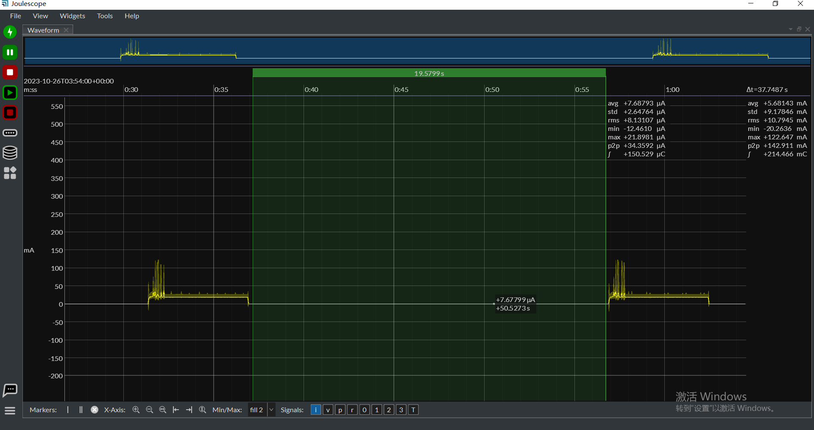

# Deep Sleep Example

| Supported Targets | ESP32-C6 | ESP32-H2 |
| ----------------- | -------- | -------- |

This example demonstrates the Thread Sleepy End Device (SED), which enters deep sleep mode during idle states to conserve power.

## Overview

The application connects to a Thread network and, after 5 seconds of being in the `CHILD` state, enters deep sleep. It can be woken up by two methods:

*   **RTC Timer:** A 20-second periodic timer.
*   **GPIO Input:** An external GPIO signal.

Deep sleep is managed by the upper-layer logic, and it is the user's responsibility to handle it in their applications. For more advanced wake-up scenarios, refer to the [deep sleep example](https://docs.espressif.com/projects/esp-idf/en/latest/esp32c6/api-reference/system/sleep_modes.html#sleep-modes) and the [deep sleep wake stub](https://docs.espressif.com/projects/esp-idf/en/latest/esp32c6/api-reference/system/sleep_modes.html#sleep-modes) documentation.

**Note:** For a standard Thread Sleepy Device, it is recommended to use the [Light Sleep example](../light_sleep) instead. Deep sleep triggers a reboot, which requires a re-attach process to rejoin the network, leading to additional packet interactions. However, it can be beneficial for applications with long sleep periods (e.g., more than 30 minutes).

## Hardware Requirements

*   Two 802.15.4 SoC development boards (one for the Leader, one for the Sleepy End Device).
*   A USB cable for power and programming.

## How to Use

### 1. Configure the OpenThread Dataset

First, run the [ot_cli](../../ot_cli/) on a separate 802.15.4 SoC to create an OpenThread network and act as the Leader. Then, configure the OpenThread dataset for the sleepy device using `idf.py menuconfig` under `Component config > Openthread > Thread Operation Dataset`. Ensure the dataset matches that of the Leader.

### 2. Build and Flash

Build and flash the project to the board with the following command:

```bash
idf.py -p <PORT> erase-flash flash monitor
```

### Example Output

When the device is running, you will see logs indicating that it has joined the OpenThread network as a Sleepy End Device (SED) and is entering deep sleep.

**Wake up from timer:**

```
I (311) ot_esp_power_save: Wake up from timer. Time spent in deep sleep and boot: 20321ms
I (531) ot_esp_power_save: Start one-shot timer for 5s to enter the deep sleep
I (5531) ot_esp_power_save: Enter deep sleep
```

**Wake up from GPIO:**

Pressing the `BOOT` button (connected to GPIO9) will also wake up the device:

```
I (321) ot_esp_power_save: Wake up from GPIO. Time spent in deep sleep and boot: 8470ms
I (531) ot_esp_power_save: Start one-shot timer for 5s to enter the deep sleep
I (5531) ot_esp_power_save: Enter deep sleep
```

### Power Consumption

During deep sleep, the power consumption is significantly reduced, as shown in the following image:


